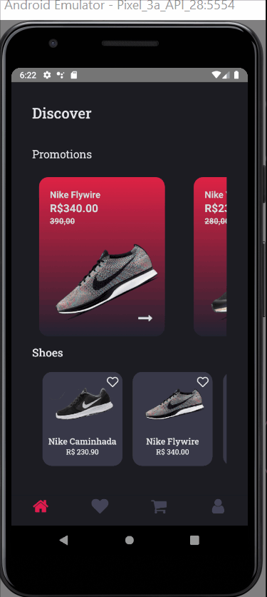

<h1 align="center">

 ReduxShoes
</br>


</h1>

<h2 align="center">



</h2>

## 📖 Sobre

O projeto foi desenvolvido para praticar estado com Redux controlando varios estado no react

</br>

## 🚀 Tecnologias utilizadas

o proejto foi desenvolvido utilizando as seguintes tecnologias

 - React-Native
 - Typescript
 - Styled-components
 - Redux

 ## 📲 Como executar o projeto

 ````bash
    #Clonar o repositorio
    $ git clone  hhttps://github.com/IgorGamantino/ShoesRedux-Mobile.git

    #Entrar no diretorio
    $ cd ShoesRedux

    #Instalar dependecias
    $ yarn


    #Executar o servidor
    $ yarn server

    #Executar
    $ yarn android ou yarn ios
 ````

 # Contato

  <a hrf="https://www.linkedin.com/in/igor-amantinoipaussu/"> Linkedin</a>
